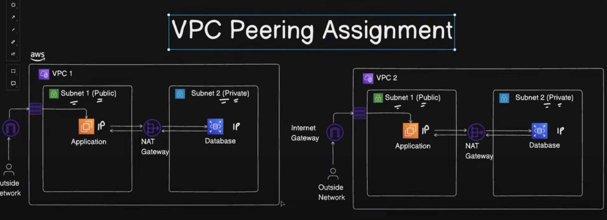

# 🚀 AWS Multi-VPC Peering with Public & Private Subnets

## 📌 Project Overview
This project demonstrates how to set up two VPCs in AWS with public and private subnets, Internet Gateway, NAT Gateway, and VPC Peering for secure cross-VPC communication.  
It is designed to simulate a **two-tier application architecture** (App in one VPC, DB in another).

---

## 🏗️ Architecture Diagram

---

## 🔧 Steps Implemented
1. Created **two VPCs** with non-overlapping CIDR ranges.  
2. Created **public and private subnets** in each VPC.  
3. Configured **Internet Gateway (IGW)** for public internet access.  
4. Added **NAT Gateway** to allow private instances outbound internet access.  
5. Updated **Route Tables** for correct traffic flow.  
6. Launched **EC2 instances** in public and private subnets.  
7. Configured **VPC Peering** between the two VPCs.  
8. Tested connectivity with `ping` and `ssh`.

---

## 📂 Repository Structure
